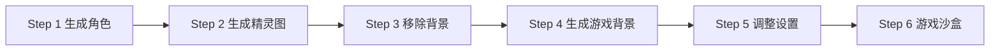

# Sprite Sheet Creator 项目分析报告

## 项目概述

**项目路径**: `D:\NodejsP\sprite-sheet-creator`

**核心功能**: AI 驱动的 2D 游戏精灵图生成工具，使用 fal.ai API 实现角色生成、精灵图制作、背景生成和背景移除。

---

## 1. 项目结构

```
sprite-sheet-creator/
├── app/                          # Next.js App Router
│   ├── api/                      # API 路由
│   │   ├── generate-background/  # 背景生成 API
│   │   ├── generate-character/   # 角色生成 API
│   │   ├── generate-sprite-sheet/ # 精灵图生成 API
│   │   └── remove-background/    # 背景移除 API
│   ├── components/
│   │   └── PixiSandbox.tsx       # 游戏沙盒组件 (617行)
│   ├── layout.tsx
│   └── page.tsx                  # 主页面 (约3000行)
├── assets/
├── next.config.js
├── package.json
└── tsconfig.json
```

---

## 2. 技术栈

| 技术 | 版本 | 用途 |
|------|------|------|
| Next.js | 14.2.21 | 全栈框架 |
| React | 18.3.1 | UI 框架 |
| @fal-ai/client | 1.2.1 | AI 图像处理 |
| pixi.js | 8.0.0 | 2D 渲染引擎 |
| Tailwind CSS | - | 样式框架 |

---

## 3. 核心模式分析

### 3.1 工作流模式

项目采用**步骤式工作流**，将复杂任务分解为 6 个明确步骤：



### 3.2 AI 图像处理模式

#### 模式一: 文本生成图像
```typescript
const result = await fal.subscribe("fal-ai/nano-banana-pro", {
  input: {
    prompt: fullPrompt,
    num_images: 1,
    aspect_ratio: "1:1",
    output_format: "png",
    resolution: "1K",
  },
});
```

#### 模式二: 图像编辑
```typescript
const result = await fal.subscribe("fal-ai/nano-banana-pro/edit", {
  input: {
    prompt: fullPrompt,
    image_urls: [imageUrl],
    num_images: 1,
  },
});
```

#### 模式三: 背景移除
```typescript
const result = await fal.subscribe("fal-ai/bria/background/remove", {
  input: {
    image_url: imageUrl,
  },
});
```

### 3.3 精灵图生成模式

**支持的动画类型**:
- Walk (行走)
- Jump (跳跃)
- Attack (攻击)
- Idle (待机)

**精灵图提示词模板**:
```typescript
const SPRITE_PROMPTS = {
  walk: `Create a 4-frame pixel art walk cycle sprite sheet...`,
  jump: `Create a 4-frame pixel art jump animation sprite sheet...`,
  attack: `Create a 4-frame pixel art attack animation sprite sheet...`,
  idle: `Create a 4-frame pixel art idle/breathing animation sprite sheet...`,
};
```

---

## 4. 关键实现细节

### 4.1 状态管理

```typescript
type Step = 1 | 2 | 3 | 4 | 5 | 6;

// 工作流状态
const [currentStep, setCurrentStep] = useState<Step>(1);
const [completedSteps, setCompletedSteps] = useState<Set<number>>(new Set());

// 输入模式切换
const [characterInputMode, setCharacterInputMode] = useState<"text" | "image">("text");
```

### 4.2 物理引擎

```typescript
const JUMP_VELOCITY = -12;
const GRAVITY = 0.6;
const MOVE_SPEED = 3;

// 游戏循环
const gameLoop = useCallback(() => {
  if (state.isJumping) {
    state.velocityY += GRAVITY * physicsScale;
    state.y += state.velocityY * physicsScale;
  }
}, []);
```

### 4.3 动画帧管理

```typescript
if (state.isWalking && walkImages.length > 0) {
  state.frameTime += deltaTime;
  const frameDuration = 1 / currentFps;
  if (state.frameTime >= frameDuration) {
    state.frameTime -= frameDuration;
    state.walkFrameIndex = (state.walkFrameIndex + 1) % walkImages.length;
  }
}
```

---

## 5. 可移植特性清单

### 5.1 高优先级 (可直接移植)

| 特性 | 描述 | 复杂度 |
|------|------|--------|
| AI 服务接口 | 统一的 AI 调用封装 | 低 |
| 精灵图提示词 | 角色和动画生成提示词模板 | 低 |
| 背景移除 | 使用 bria 模型移除背景 | 低 |
| 步骤式工作流 UI | 分步引导用户操作 | 中 |

### 5.2 中优先级 (需要适配)

| 特性 | 描述 | 复杂度 |
|------|------|--------|
| 精灵图提取 | 从精灵图中裁剪单帧 | 中 |
| 动画控制器 | 帧动画播放管理 | 中 |
| 游戏预览沙盒 | Canvas 渲染和交互 | 高 |

### 5.3 低优先级 (需要重写)

| 特性 | 描述 | 复杂度 |
|------|------|--------|
| 物理引擎 | 跳跃和移动物理 | 高 |
| 键盘输入 | 游戏控制逻辑 | 中 |

---

## 6. API 端点分析

### 6.1 generate-character
- **功能**: 根据文本或图像生成角色
- **模型**: fal-ai/nano-banana-pro
- **输入**: prompt (文本) 或 image_url (图像)
- **输出**: 角色图像 URL

### 6.2 generate-sprite-sheet
- **功能**: 生成精灵图
- **模型**: fal-ai/nano-banana-pro/edit
- **输入**: characterImageUrl, type (walk/jump/attack/idle)
- **输出**: 精灵图 URL

### 6.3 remove-background
- **功能**: 移除图像背景
- **模型**: fal-ai/bria/background/remove
- **输入**: image_url
- **输出**: 透明背景图像

### 6.4 generate-background
- **功能**: 生成游戏背景
- **模型**: fal-ai/nano-banana-pro
- **输入**: characterUrl, characterPrompt
- **输出**: 背景图像 URL

---

## 7. 与 NanoBananaEditor 对比

| 功能 | sprite-sheet-creator | NanoBananaEditor |
|------|---------------------|------------------|
| AI 提供商 | fal.ai | Gemini / AIStudioToAPI |
| 图像生成 | nano-banana-pro | gemini-2.5-flash-image |
| 背景移除 | bria | 无 |
| 精灵图生成 | 专用模板 | 无 |
| 工作流 | 6 步骤 | 单一模式 |
| 游戏预览 | Pixi.js | 无 |

---

## 8. 参考资源

- [fal.ai 文档](https://fal.ai/docs)
- [Pixi.js 文档](https://pixijs.com/)
- [Next.js App Router](https://nextjs.org/docs/app)
