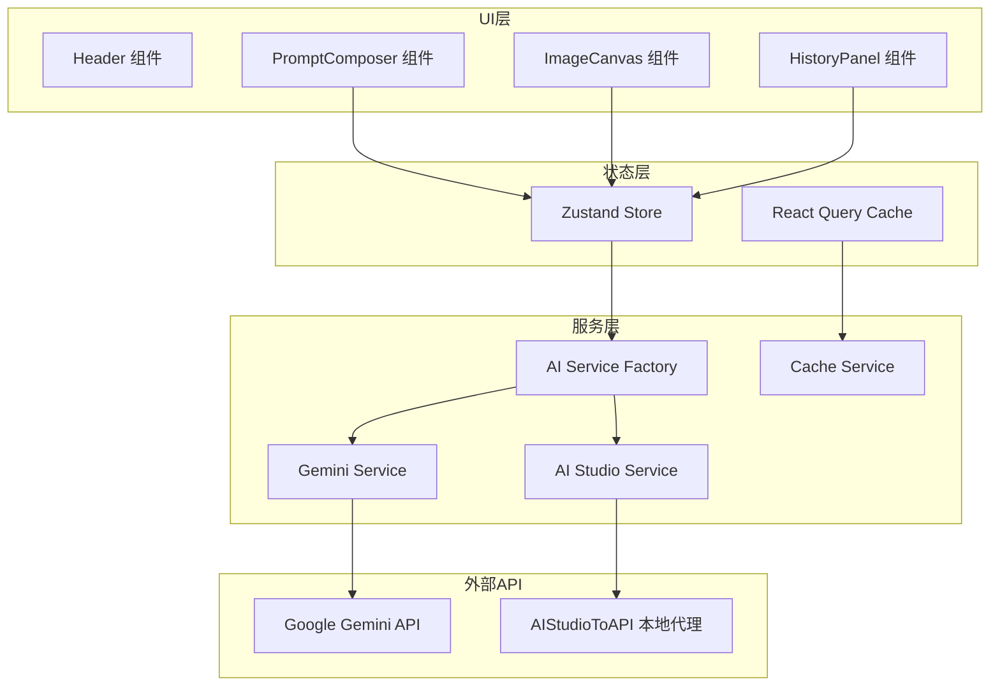
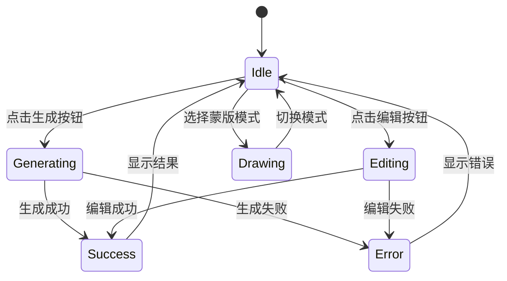
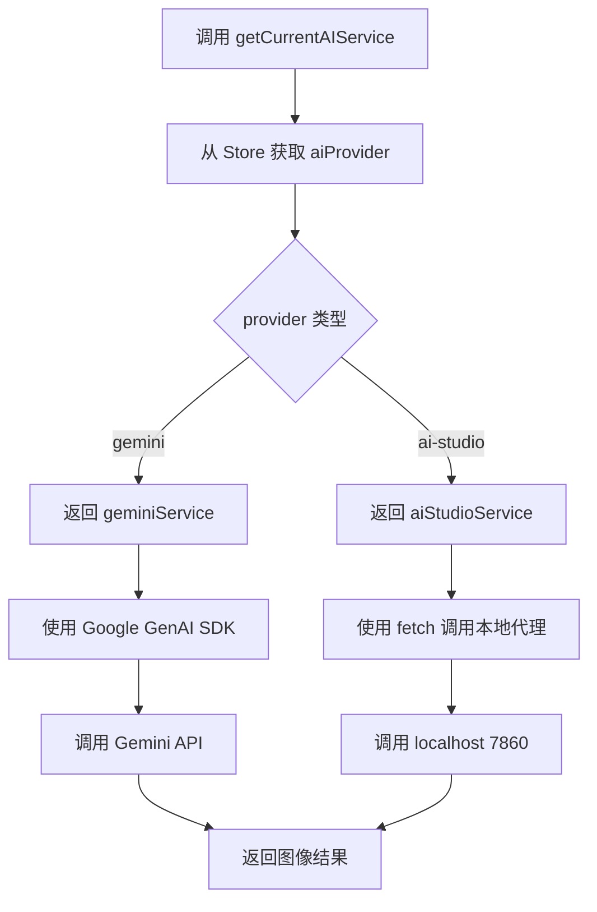

# 公共逻辑

本文档包含所有模式共用的逻辑和架构说明。

## 目录

- [项目概述](#项目概述)
- [技术栈](#技术栈)
- [整体架构](#整体架构)
- [状态管理](#状态管理)
- [AI 服务工厂](#ai-服务工厂)
- [核心类型定义](#核心类型定义)
- [键盘快捷键](#键盘快捷键)

---

## 项目概述

Nano Banana Editor 是一个基于 React + TypeScript 的 AI 图像生成与编辑平台，使用 Google Gemini 2.5 Flash Image 模型实现：

- **文本生成图像** - 通过描述性提示词创建图像
- **对话式编辑** - 使用自然语言修改图像
- **区域感知选择** - 绘制蒙版来精确定位编辑区域

---

## 技术栈

| 层级 | 技术 | 用途 |
|------|------|------|
| 前端框架 | React 18 + TypeScript | UI 组件和类型安全 |
| 状态管理 | Zustand | 应用状态 |
| 服务端状态 | React Query | API 调用和缓存 |
| 画布 | Konva.js | 交互式图像显示和蒙版绘制 |
| AI 集成 | Google Generative AI SDK | Gemini API 调用 |
| 本地存储 | IndexedDB | 离线资源缓存 |
| 构建工具 | Vite | 开发和打包 |
| 样式 | Tailwind CSS | 原子化 CSS |

---

## 整体架构

### 系统架构图



### 目录结构

```
src/
├── components/              # React 组件
│   ├── ui/                 # 通用 UI 组件
│   │   ├── Button.tsx
│   │   ├── Input.tsx
│   │   └── Textarea.tsx
│   ├── PromptComposer.tsx  # 提示词输入和工具选择
│   ├── ImageCanvas.tsx     # 交互式画布
│   ├── HistoryPanel.tsx    # 生成历史
│   ├── Header.tsx          # 应用头部
│   ├── PromptHints.tsx     # 提示词提示
│   └── LanguageSwitcher.tsx
├── services/               # 外部服务集成
│   ├── geminiService.ts    # Gemini API 客户端
│   ├── aiStudioService.ts  # AI Studio 代理服务
│   ├── aiServiceFactory.ts # 服务工厂
│   ├── aiServiceInterface.ts # 服务接口定义
│   ├── cacheService.ts     # IndexedDB 缓存层
│   └── imageProcessing.ts  # 图像处理工具
├── store/                  # Zustand 状态管理
│   └── useAppStore.ts      # 全局应用状态
├── hooks/                  # 自定义 React Hooks
│   ├── useImageGeneration.ts  # 生成和编辑逻辑
│   └── useKeyboardShortcuts.ts # 键盘导航
├── utils/                  # 工具函数
│   ├── cn.ts               # Class name 合并
│   └── imageUtils.ts       # 图像处理辅助
├── types/                  # TypeScript 类型定义
│   └── index.ts            # 核心类型定义
└── i18n/                   # 国际化
    ├── index.ts
    └── locales/
        ├── zh.json
        └── en.json
```

---

## 状态管理

### Zustand Store 结构

```typescript
// src/store/useAppStore.ts

interface AppState {
  // ========== 项目状态 ==========
  currentProject: Project | null;

  // ========== 画布状态 ==========
  canvasImage: string | null;           // 当前画布图像 URL
  canvasZoom: number;                   // 缩放级别 (0.1 - 3)
  canvasPan: { x: number; y: number };  // 平移偏移

  // ========== 上传状态 ==========
  uploadedImages: string[];             // 生成模式参考图 (最多2张)
  editReferenceImages: string[];        // 编辑模式参考图 (最多2张)

  // ========== 蒙版绘制状态 ==========
  brushStrokes: BrushStroke[];          // 笔触数组
  brushSize: number;                    // 画笔大小 (5 - 50)
  showMasks: boolean;                   // 显示/隐藏蒙版
  selectedMask: SegmentationMask | null;

  // ========== 生成状态 ==========
  isGenerating: boolean;                // 是否正在生成
  currentPrompt: string;                // 当前提示词
  temperature: number;                  // 创造力参数 (0 - 1)
  seed: number | null;                  // 随机种子

  // ========== 历史和变体 ==========
  selectedGenerationId: string | null;  // 选中的生成ID
  selectedEditId: string | null;        // 选中的编辑ID
  showHistory: boolean;                 // 显示历史面板

  // ========== UI 状态 ==========
  showPromptPanel: boolean;             // 显示提示词面板
  selectedTool: 'generate' | 'edit' | 'mask';  // 当前工具

  // ========== AI 渠道 ==========
  aiProvider: 'gemini' | 'ai-studio';   // 当前 AI 服务

  // ========== Actions ==========
  // 项目操作
  setCurrentProject: (project: Project | null) => void;

  // 画布操作
  setCanvasImage: (url: string | null) => void;
  setCanvasZoom: (zoom: number) => void;
  setCanvasPan: (pan: { x: number; y: number }) => void;

  // 上传操作
  addUploadedImage: (url: string) => void;
  removeUploadedImage: (index: number) => void;
  clearUploadedImages: () => void;
  addEditReferenceImage: (url: string) => void;
  removeEditReferenceImage: (index: number) => void;
  clearEditReferenceImages: () => void;

  // 蒙版操作
  addBrushStroke: (stroke: BrushStroke) => void;
  clearBrushStrokes: () => void;
  setBrushSize: (size: number) => void;
  setShowMasks: (show: boolean) => void;
  setSelectedMask: (mask: SegmentationMask | null) => void;

  // 生成操作
  setIsGenerating: (generating: boolean) => void;
  setCurrentPrompt: (prompt: string) => void;
  setTemperature: (temp: number) => void;
  setSeed: (seed: number | null) => void;

  // 历史操作
  addGeneration: (generation: Generation) => void;
  addEdit: (edit: Edit) => void;
  selectGeneration: (id: string | null) => void;
  selectEdit: (id: string | null) => void;
  setShowHistory: (show: boolean) => void;

  // UI 操作
  setShowPromptPanel: (show: boolean) => void;
  setSelectedTool: (tool: 'generate' | 'edit' | 'mask') => void;
  setAIProvider: (provider: AIProvider) => void;
}
```

### 状态流转图



---

## AI 服务工厂

### 服务接口定义

```typescript
// src/services/aiServiceInterface.ts

/**
 * AI 服务统一接口
 *
 * AIServiceInterface
 *   ├─> generateImage(request)    生成图片
 *   ├─> editImage(request)        编辑图片
 *   └─> segmentImage(request)     分割图片(可选)
 */

export interface AIServiceInterface {
  // 服务名称标识
  readonly name: string;

  // 生成图片
  generateImage(request: GenerationRequest): Promise<string[]>;

  // 编辑图片
  editImage(request: EditRequest): Promise<string[]>;

  // 分割图片(可选)
  segmentImage?(request: SegmentationRequest): Promise<SegmentationResult>;
}
```

### 工厂模式实现

```typescript
// src/services/aiServiceFactory.ts

/**
 * AIServiceFactory 工厂模式:
 *   ├─> getService(provider)
 *   │     ├─> provider === 'gemini'
 *   │     │     └─> return geminiService
 *   │     └─> provider === 'ai-studio'
 *   │           └─> return aiStudioService
 *   └─> getCurrentService()
 *         └─> 从 store 获取当前 provider
 *               └─> return getService(provider)
 */

// 服务实例映射
const services: Record<AIProvider, AIServiceInterface> = {
  gemini: geminiService,
  'ai-studio': aiStudioService,
};

// 根据 provider 类型获取对应的 AI 服务实例
export function getAIService(provider: AIProvider): AIServiceInterface {
  const service = services[provider];
  if (!service) {
    console.warn(`未知的 AI Provider: ${provider}, 回退到 ai-studio`);
    return services['ai-studio'];
  }
  return service;
}

// 获取当前 store 中配置的 AI 服务实例
export function getCurrentAIService(): AIServiceInterface {
  const provider = useAppStore.getState().aiProvider;
  return getAIService(provider);
}
```

### AI 服务工厂流程图



---

## 核心类型定义

```typescript
// src/types/index.ts

// ========== 资产类型 ==========
export interface Asset {
  id: string;
  type: 'original' | 'mask' | 'output';  // 原始/蒙版/输出
  url: string;                            // data:image/png;base64,...
  mime: string;                           // image/png
  width: number;
  height: number;
  checksum: string;
}

// ========== 生成记录 ==========
export interface Generation {
  id: string;
  prompt: string;
  parameters: {
    seed?: number;
    temperature?: number;
  };
  sourceAssets: Asset[];      // 参考图片
  outputAssets: Asset[];      // 生成的图片
  modelVersion: string;
  timestamp: number;
  costEstimate?: number;
}

// ========== 编辑记录 ==========
export interface Edit {
  id: string;
  parentGenerationId: string;
  maskAssetId?: string;
  maskReferenceAsset?: Asset;
  instruction: string;        // 编辑指令
  outputAssets: Asset[];      // 编辑后的图片
  timestamp: number;
}

// ========== 项目 ==========
export interface Project {
  id: string;
  title: string;
  generations: Generation[];
  edits: Edit[];
  createdAt: number;
  updatedAt: number;
}

// ========== 蒙版相关 ==========
export interface SegmentationMask {
  id: string;
  imageData: ImageData;
  bounds: {
    x: number;
    y: number;
    width: number;
    height: number;
  };
  feather: number;
}

export interface BrushStroke {
  id: string;
  points: number[];           // [x1, y1, x2, y2, ...]
  brushSize: number;
  color: string;              // #A855F7 紫色
}

// ========== 提示词提示 ==========
export interface PromptHint {
  category: 'subject' | 'scene' | 'action' | 'style' | 'camera';
  text: string;
  example: string;
}

// ========== AI 渠道 ==========
export type AIProvider = 'gemini' | 'ai-studio';

export interface ProviderConfig {
  gemini: {
    apiKey: string;
  };
  'ai-studio': {
    apiKey: string;
    endpoint: string;
  };
}
```

---

## 键盘快捷键

### 快捷键映射表

| 快捷键 | 动作 | 实现位置 |
|--------|------|----------|
| `Cmd/Ctrl + Enter` | 生成/应用编辑 | 输入框内 |
| `Shift + R` | 重新生成变体 | 全局 |
| `E` | 切换到编辑模式 | 全局 |
| `G` | 切换到生成模式 | 全局 |
| `M` | 切换到蒙版模式 | 全局 |
| `H` | 切换历史面板 | 全局 |
| `P` | 切换提示词面板 | 全局 |

### 快捷键实现代码

```typescript
// src/hooks/useKeyboardShortcuts.ts

export const useKeyboardShortcuts = () => {
  const {
    setSelectedTool,
    setShowHistory,
    showHistory,
    setShowPromptPanel,
    showPromptPanel,
    currentPrompt,
    isGenerating
  } = useAppStore();

  useEffect(() => {
    const handleKeyDown = (event: KeyboardEvent) => {
      // 如果用户正在输入框中, 只处理 Cmd/Ctrl + Enter
      if (event.target instanceof HTMLInputElement ||
          event.target instanceof HTMLTextAreaElement) {
        if ((event.metaKey || event.ctrlKey) && event.key === 'Enter') {
          event.preventDefault();
          if (!isGenerating && currentPrompt.trim()) {
            console.log('Generate via keyboard shortcut');
          }
        }
        return;
      }

      // 全局快捷键
      switch (event.key.toLowerCase()) {
        case 'e':
          event.preventDefault();
          setSelectedTool('edit');
          break;
        case 'g':
          event.preventDefault();
          setSelectedTool('generate');
          break;
        case 'm':
          event.preventDefault();
          setSelectedTool('mask');
          break;
        case 'h':
          event.preventDefault();
          setShowHistory(!showHistory);
          break;
        case 'p':
          event.preventDefault();
          setShowPromptPanel(!showPromptPanel);
          break;
        case 'r':
          if (event.shiftKey) {
            event.preventDefault();
            console.log('Re-roll variants');
          }
          break;
      }
    };

    window.addEventListener('keydown', handleKeyDown);
    return () => window.removeEventListener('keydown', handleKeyDown);
  }, [setSelectedTool, setShowHistory, showHistory, setShowPromptPanel, showPromptPanel, currentPrompt, isGenerating]);
};
```

---

## 提示词质量检测

### 检测逻辑

```typescript
// src/components/PromptComposer.tsx

// 根据提示词长度显示不同状态
const getPromptQuality = (length: number) => {
  if (length < 20) {
    return { status: 'warning', message: '提示词太短', color: 'red' };
  } else if (length < 50) {
    return { status: 'good', message: '良好', color: 'yellow' };
  } else {
    return { status: 'excellent', message: '优秀', color: 'green' };
  }
};
```

### 提示词分类提示

| 分类 | 说明 | 颜色标识 |
|------|------|----------|
| subject | 主体描述 | 蓝色 |
| scene | 场景设定 | 绿色 |
| action | 动作状态 | 紫色 |
| style | 艺术风格 | 橙色 |
| camera | 镜头视角 | 粉色 |

---

*返回 [README.md](./README.md)*
