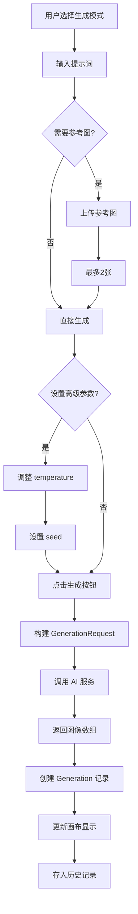
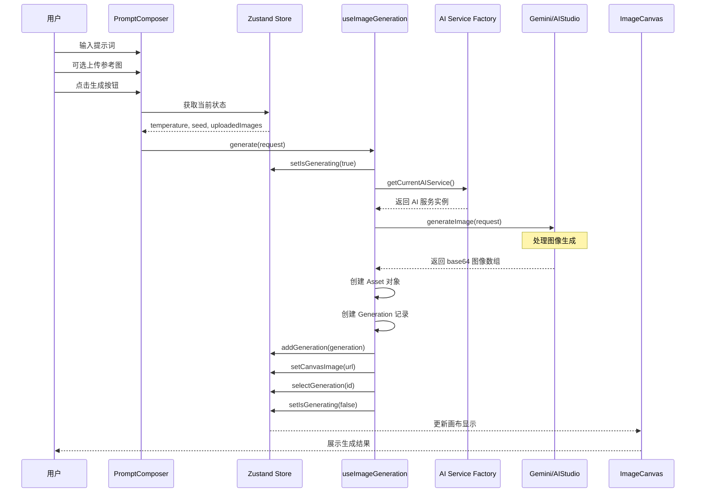

# 生成模式 (Generate)

本文档详细说明生成模式的完整流程和代码逻辑。

## 目录

- [模式概述](#模式概述)
- [核心流程](#核心流程)
- [时序图](#时序图)
- [提示词构建](#提示词构建)
- [代码实现](#代码实现)
- [UI 组件](#ui-组件)

---

## 模式概述

### 用途

从文本描述创建全新图像。

### 特点

| 特性 | 说明 |
|------|------|
| 参考图片 | 最多 2 张 |
| 创造力参数 | temperature (0-1) |
| 随机种子 | 可选，用于复现结果 |
| 输出格式 | 1024x1024 PNG |

### 入口条件

```typescript
// src/store/useAppStore.ts
selectedTool: 'generate'
```

---

## 核心流程



---

## 时序图



---

## 提示词构建

### 请求结构

```typescript
// src/services/geminiService.ts

export interface GenerationRequest {
  prompt: string;              // 用户输入的提示词
  referenceImages?: string[];  // 参考图片 base64 数组
  temperature?: number;        // 创造力参数 (0-1)
  seed?: number;               // 随机种子
}
```

### 提示词处理

生成模式**直接使用用户输入**，不进行额外的包装或转换：

```typescript
// src/hooks/useImageGeneration.ts

const handleGenerate = () => {
  const referenceImages = uploadedImages
    .filter((image) => image.includes('base64,'))
    .map((image) => image.split('base64,')[1]);

  generate({
    prompt: currentPrompt,                              // 直接使用
    referenceImages: referenceImages.length > 0 ? referenceImages : undefined,
    temperature,
    seed: seed ?? undefined,
  });
};
```

### AI 服务调用

```typescript
// src/services/geminiService.ts

async generateImage(request: GenerationRequest): Promise<string[]> {
  try {
    // 1. 构建内容数组
    const contents: Part[] = [{ text: request.prompt }];

    // 2. 添加参考图片
    request.referenceImages?.forEach((image) => {
      contents.push({
        inlineData: {
          mimeType: 'image/png',
          data: image,
        },
      });
    });

    // 3. 调用 API
    const response = await genAI.models.generateContent({
      model: GEMINI_IMAGE_MODEL,
      contents,
    });

    // 4. 提取返回的图片
    return this.extractInlineImages(response);
  } catch (error) {
    console.error('调用 Gemini 生成图片失败:', error);
    throw new Error('Failed to generate image. Please try again.');
  }
}
```

---

## 代码实现

### useImageGeneration Hook

```typescript
// src/hooks/useImageGeneration.ts

export const useImageGeneration = () => {
  const generateMutation = useMutation({
    // ========== 执行生成 ==========
    mutationFn: async (request: GenerationRequest) => {
      const service = getCurrentAIService();
      return service.generateImage(request);
    },

    // ========== 开始时 ==========
    onMutate: () => {
      useAppStore.getState().setIsGenerating(true);
    },

    // ========== 成功后 ==========
    onSuccess: (images, request) => {
      const state = useAppStore.getState();

      // 检查返回结果
      if (images.length === 0) {
        state.setIsGenerating(false);
        return;
      }

      // 创建输出资产
      const outputAssets = images.map((base64) =>
        createAsset(base64, 'output')
      );

      // 创建源资产(参考图)
      const sourceAssets = (request.referenceImages ?? []).map((base64) =>
        createAsset(base64, 'original')
      );

      // 创建生成记录
      const generation: Generation = {
        id: generateId(),
        prompt: request.prompt,
        parameters: {
          seed: request.seed,
          temperature: request.temperature,
        },
        sourceAssets,
        outputAssets,
        modelVersion: `${GEMINI_IMAGE_MODEL} (${state.aiProvider})`,
        timestamp: Date.now(),
      };

      // 更新项目
      if (state.currentProject) {
        state.addGeneration(generation);
      } else {
        state.setCurrentProject(
          createProject({
            generations: [generation],
            edits: [],
          })
        );
      }

      // 更新画布和选中状态
      state.setCanvasImage(outputAssets[0].url);
      state.selectGeneration(generation.id);
      state.selectEdit(null);
      state.setIsGenerating(false);
    },

    // ========== 错误处理 ==========
    onError: (error) => {
      console.error('生成图片失败:', error);
      useAppStore.getState().setIsGenerating(false);
    },
  });

  return {
    generate: generateMutation.mutate,
    isGenerating: generateMutation.isPending,
    error: generateMutation.error,
  };
};
```

### 辅助函数

```typescript
// src/hooks/useImageGeneration.ts

const DEFAULT_IMAGE_SIZE = 1024;

// 创建资产对象
const createAsset = (base64: string, type: Asset['type']): Asset => ({
  id: generateId(),
  type,
  url: `data:image/png;base64,${base64}`,
  mime: 'image/png',
  width: DEFAULT_IMAGE_SIZE,
  height: DEFAULT_IMAGE_SIZE,
  checksum: base64.slice(0, 32),
});

// 提取 base64 数据
const extractBase64 = (value: string) =>
  value.includes('base64,') ? value.split('base64,')[1] : value;

// 创建项目
const createProject = (project: Pick<Project, 'generations' | 'edits'>): Project => ({
  id: generateId(),
  title: 'Untitled Project',
  generations: project.generations,
  edits: project.edits,
  createdAt: Date.now(),
  updatedAt: Date.now(),
});
```

---

## UI 组件

### PromptComposer 生成模式部分

```typescript
// src/components/PromptComposer.tsx

// 工具定义
const tools = [
  {
    id: 'generate',
    icon: Wand2,
    label: t('promptComposer.tools.generate'),
    description: t('promptComposer.tools.generateDesc')
  },
  // ... 其他工具
] as const;

// 生成按钮点击处理
const handleGenerate = () => {
  if (!currentPrompt.trim()) {
    return;
  }

  if (selectedTool === 'generate') {
    // 提取参考图片的 base64
    const referenceImages = uploadedImages
      .filter((image) => image.includes('base64,'))
      .map((image) => image.split('base64,')[1]);

    // 调用生成
    generate({
      prompt: currentPrompt,
      referenceImages: referenceImages.length > 0 ? referenceImages : undefined,
      temperature,
      seed: seed ?? undefined,
    });
    return;
  }

  // 编辑模式走另一条路径
  edit(currentPrompt);
};
```

### 参考图上传区域

```typescript
// 生成模式下显示的参考图区域
{selectedTool === 'generate' && (
  <>
    <label className="text-sm font-medium text-gray-300 mb-1 block">
      {t('promptComposer.referenceImages')}
    </label>
    <p className="text-xs text-gray-500 mb-3">
      {t('promptComposer.generateHint')}
    </p>

    <Button
      variant="outline"
      onClick={() => fileInputRef.current?.click()}
      className="w-full"
      disabled={uploadedImages.length >= 2}
    >
      <Upload className="h-4 w-4 mr-2" />
      {t('promptComposer.upload')}
    </Button>

    {/* 显示已上传的参考图 */}
    {uploadedImages.length > 0 && (
      <div className="mt-3 space-y-2">
        {uploadedImages.map((image, index) => (
          <div key={index} className="relative">
            
            <button onClick={() => removeUploadedImage(index)}>x</button>
          </div>
        ))}
      </div>
    )}
  </>
)}
```

### 生成按钮

```typescript
<Button
  onClick={handleGenerate}
  disabled={isGenerating || !currentPrompt.trim()}
  className="w-full h-14 text-base font-medium"
>
  {isGenerating ? (
    <>
      <div className="animate-spin rounded-full h-4 w-4 border-b-2 border-gray-900 mr-2" />
      {t('promptComposer.generating')}
    </>
  ) : (
    <>
      <Wand2 className="h-4 w-4 mr-2" />
      {t('promptComposer.generate')}
    </>
  )}
</Button>
```

---

## 高级参数

### Temperature 滑块

```typescript
// 创造力参数控制
<div>
  <label className="text-xs text-gray-400 mb-2 block">
    {t('promptComposer.creativity')} ({temperature})
  </label>
  <input
    type="range"
    min="0"
    max="1"
    step="0.1"
    value={temperature}
    onChange={(e) => setTemperature(parseFloat(e.target.value))}
    className="w-full h-2 bg-gray-800 rounded-lg appearance-none cursor-pointer slider"
  />
</div>
```

| Temperature 值 | 效果 |
|----------------|------|
| 0 | 确定性输出，相同提示词产生相似结果 |
| 0.5 | 平衡创造力和一致性 |
| 1 | 最大创造力，结果更加多样 |

### Seed 输入

```typescript
// 随机种子控制
<div>
  <label className="text-xs text-gray-400 mb-2 block">
    {t('promptComposer.seed')}
  </label>
  <input
    type="number"
    value={seed ?? ''}
    onChange={(e) => setSeed(e.target.value ? parseInt(e.target.value, 10) : null)}
    placeholder={t('promptComposer.seedPlaceholder')}
    className="w-full h-8 px-2 bg-gray-900 border border-gray-700 rounded text-xs text-gray-100"
  />
</div>
```

---

*返回 [README.md](./README.md)* | 下一篇 [02_编辑模式.md](./02_编辑模式.md)*
