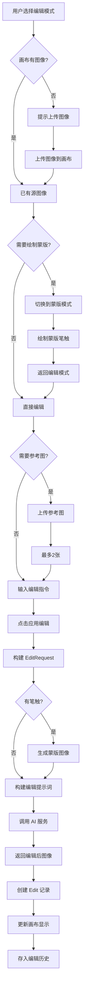
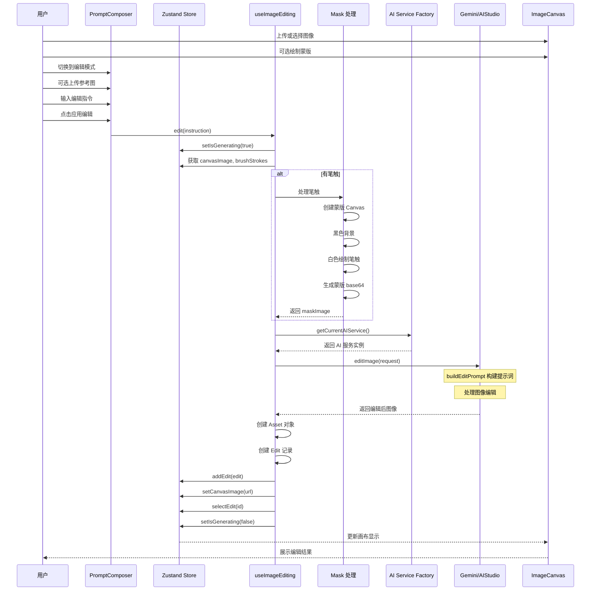
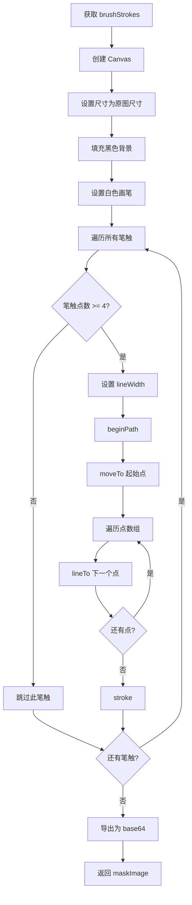
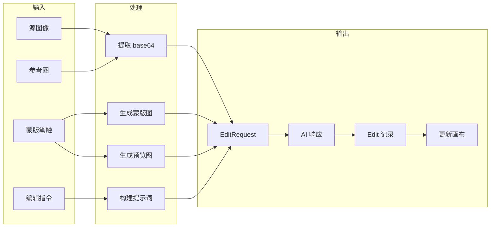

# 编辑模式 (Edit)

本文档详细说明编辑模式的完整流程和代码逻辑。

## 目录

- [模式概述](#模式概述)
- [核心流程](#核心流程)
- [时序图](#时序图)
- [提示词构建](#提示词构建)
- [蒙版处理](#蒙版处理)
- [代码实现](#代码实现)
- [UI 组件](#ui-组件)

---

## 模式概述

### 用途

对现有图像进行自然语言编辑修改。

### 特点

| 特性 | 说明 |
|------|------|
| 源图像 | 必须有画布图像或上传图像 |
| 蒙版支持 | 可选，精确定位编辑区域 |
| 参考图片 | 最多 2 张风格参考 |
| 保持风格 | 保持原始图像的光照和构图 |

### 入口条件

```typescript
// src/store/useAppStore.ts
selectedTool: 'edit'
```

### 与生成模式的区别

| 对比项 | 生成模式 | 编辑模式 |
|--------|----------|----------|
| 输入 | 提示词 + 可选参考图 | 提示词 + 源图像 + 可选蒙版 + 可选参考图 |
| 提示词处理 | 直接使用 | 包装为编辑指令 |
| 输出 | 全新图像 | 修改后的原图 |
| 必要条件 | 提示词不为空 | 提示词不为空 + 有源图像 |

---

## 核心流程



---

## 时序图



---

## 提示词构建

### 请求结构

```typescript
// src/services/geminiService.ts

export interface EditRequest {
  instruction: string;         // 用户编辑指令
  originalImage: string;       // 原图 base64
  referenceImages?: string[];  // 参考图片 base64 数组
  maskImage?: string;          // 蒙版图像 base64 (可选)
  temperature?: number;        // 创造力参数
  seed?: number;               // 随机种子
}
```

### 编辑提示词模板

编辑模式会对用户输入进行**包装处理**，添加专业的编辑指令：

```typescript
// src/services/geminiService.ts
// src/services/aiStudioService.ts

private buildEditPrompt(request: EditRequest): string {
  // 蒙版指令 (仅在有蒙版时添加)
  const maskInstruction = request.maskImage
    ? '\n\nIMPORTANT: Apply changes ONLY where the mask image shows white pixels (value 255). Leave all other areas completely unchanged. Respect the mask boundaries precisely and maintain seamless blending at the edges.'
    : '';

  // 最终提示词
  return `Edit this image according to the following instruction: ${request.instruction}

Maintain the original image's lighting, perspective, and overall composition. Make the changes look natural and seamlessly integrated.${maskInstruction}

Preserve image quality and ensure the edit looks professional and realistic.`;
}
```

### 提示词结构对比

```
用户输入:
"把狮子的眼睛改成蓝色"

buildEditPrompt 输出:
"""
Edit this image according to the following instruction: 把狮子的眼睛改成蓝色

Maintain the original image's lighting, perspective, and overall composition.
Make the changes look natural and seamlessly integrated.

IMPORTANT: Apply changes ONLY where the mask image shows white pixels (value 255).
Leave all other areas completely unchanged. Respect the mask boundaries precisely
and maintain seamless blending at the edges.

Preserve image quality and ensure the edit looks professional and realistic.
"""
```

---

## 蒙版处理

### 蒙版生成流程



### 蒙版生成代码

```typescript
// src/hooks/useImageGeneration.ts

// 蒙版处理逻辑
if (brushStrokes.length > 0) {
  // 1. 加载源图像获取尺寸
  const tempImage = await loadImage(sourceImage);

  // 2. 创建蒙版画布
  const maskCanvas = document.createElement('canvas');
  const maskContext = maskCanvas.getContext('2d');
  if (!maskContext) {
    throw new Error('无法创建蒙版画布');
  }

  // 3. 设置画布尺寸
  maskCanvas.width = tempImage.width;
  maskCanvas.height = tempImage.height;

  // 4. 填充黑色背景
  maskContext.fillStyle = 'black';
  maskContext.fillRect(0, 0, maskCanvas.width, maskCanvas.height);

  // 5. 设置白色画笔
  maskContext.strokeStyle = 'white';
  maskContext.lineCap = 'round';
  maskContext.lineJoin = 'round';

  // 6. 绘制所有笔触
  brushStrokes.forEach((stroke) => {
    if (stroke.points.length < 4) {
      return; // 跳过无效笔触
    }

    maskContext.lineWidth = stroke.brushSize;
    maskContext.beginPath();
    maskContext.moveTo(stroke.points[0], stroke.points[1]);

    for (let i = 2; i < stroke.points.length; i += 2) {
      maskContext.lineTo(stroke.points[i], stroke.points[i + 1]);
    }

    maskContext.stroke();
  });

  // 7. 导出为 base64
  maskImage = maskCanvas.toDataURL('image/png').split('base64,')[1];
}
```

### 预览图生成

同时生成一个带紫色笔触的预览图，作为参考图发送给 AI：

```typescript
// 创建预览画布
const previewCanvas = document.createElement('canvas');
const previewContext = previewCanvas.getContext('2d');

previewCanvas.width = tempImage.width;
previewCanvas.height = tempImage.height;

// 绘制原图
previewContext.drawImage(tempImage, 0, 0);

// 绘制半透明紫色笔触
previewContext.globalAlpha = 0.4;
previewContext.strokeStyle = '#A855F7';
previewContext.lineCap = 'round';
previewContext.lineJoin = 'round';

brushStrokes.forEach((stroke) => {
  // ... 绘制逻辑同蒙版
});

previewContext.globalAlpha = 1;

// 导出预览图
maskedReferenceImage = previewCanvas.toDataURL('image/png').split('base64,')[1];

// 添加到参考图数组
referenceImages = [maskedReferenceImage, ...referenceImages];
```

---

## 代码实现

### useImageEditing Hook

```typescript
// src/hooks/useImageGeneration.ts

export const useImageEditing = () => {
  const editMutation = useMutation({
    // ========== 执行编辑 ==========
    mutationFn: async (instruction: string) => {
      const {
        canvasImage,
        uploadedImages,
        editReferenceImages,
        brushStrokes,
        seed,
        temperature,
      } = useAppStore.getState();

      // 1. 获取源图像
      const sourceImage = canvasImage || uploadedImages[0];
      if (!sourceImage) {
        throw new Error('No image to edit');
      }

      const base64Image = extractBase64(sourceImage);
      let referenceImages = editReferenceImages.map(extractBase64);
      let maskImage: string | undefined;
      let maskedReferenceImage: string | undefined;

      // 2. 处理蒙版 (如果有笔触)
      if (brushStrokes.length > 0) {
        const tempImage = await loadImage(sourceImage);

        // 创建蒙版
        const maskCanvas = document.createElement('canvas');
        const maskContext = maskCanvas.getContext('2d');
        // ... 蒙版绘制代码

        maskImage = maskCanvas.toDataURL('image/png').split('base64,')[1];

        // 创建预览图
        const previewCanvas = document.createElement('canvas');
        const previewContext = previewCanvas.getContext('2d');
        // ... 预览图绘制代码

        maskedReferenceImage = previewCanvas.toDataURL('image/png').split('base64,')[1];
        referenceImages = [maskedReferenceImage, ...referenceImages];
      }

      // 3. 构建请求
      const request: EditRequest = {
        instruction,
        originalImage: base64Image,
        referenceImages: referenceImages.length > 0 ? referenceImages : undefined,
        maskImage,
        temperature,
        seed: seed ?? undefined,
      };

      // 4. 调用 AI 服务
      const images = await getCurrentAIService().editImage(request);
      return { images, maskedReferenceImage };
    },

    // ========== 开始时 ==========
    onMutate: () => {
      useAppStore.getState().setIsGenerating(true);
    },

    // ========== 成功后 ==========
    onSuccess: ({ images, maskedReferenceImage }, instruction) => {
      const state = useAppStore.getState();

      if (images.length === 0) {
        state.setIsGenerating(false);
        return;
      }

      // 创建资产
      const outputAssets = images.map((base64) => createAsset(base64, 'output'));
      const maskReferenceAsset = maskedReferenceImage
        ? createAsset(maskedReferenceImage, 'mask')
        : undefined;

      // 获取父生成记录
      const currentProject = state.currentProject;
      const lastGeneration =
        currentProject && currentProject.generations.length > 0
          ? currentProject.generations[currentProject.generations.length - 1]
          : undefined;

      // 创建编辑记录
      const edit: Edit = {
        id: generateId(),
        parentGenerationId: state.selectedGenerationId || lastGeneration?.id || '',
        maskAssetId: maskReferenceAsset?.id,
        maskReferenceAsset,
        instruction,
        outputAssets,
        timestamp: Date.now(),
      };

      // 更新项目
      if (currentProject) {
        state.addEdit(edit);
      } else {
        state.setCurrentProject(
          createProject({
            generations: [],
            edits: [edit],
          })
        );
      }

      // 更新画布和选中状态
      state.setCanvasImage(outputAssets[0].url);
      state.selectEdit(edit.id);
      state.selectGeneration(null);
      state.setIsGenerating(false);
    },

    // ========== 错误处理 ==========
    onError: (error) => {
      console.error('编辑图片失败:', error);
      useAppStore.getState().setIsGenerating(false);
    },
  });

  return {
    edit: editMutation.mutate,
    isEditing: editMutation.isPending,
    error: editMutation.error,
  };
};
```

### 辅助函数

```typescript
// 加载图像
const loadImage = (source: string) =>
  new Promise<HTMLImageElement>((resolve, reject) => {
    const image = new Image();
    image.onload = () => resolve(image);
    image.onerror = () => reject(new Error('图片加载失败'));
    image.src = source;
  });
```

---

## UI 组件

### PromptComposer 编辑模式部分

```typescript
// src/components/PromptComposer.tsx

// 编辑模式下的 UI
{selectedTool === 'edit' && (
  <>
    <label className="text-sm font-medium text-gray-300 mb-1 block">
      {t('promptComposer.editImage')}
    </label>

    <p className="text-xs text-gray-500 mb-3">
      {canvasImage
        ? t('promptComposer.editHintWithCanvas')
        : t('promptComposer.editHintNoCanvas')}
    </p>

    {/* 上传按钮 */}
    <Button
      variant="outline"
      onClick={() => fileInputRef.current?.click()}
      className="w-full"
      disabled={canvasImage !== null && editReferenceImages.length >= 2}
    >
      <Upload className="h-4 w-4 mr-2" />
      {t('promptComposer.upload')}
    </Button>

    {/* 参考图列表 */}
    {editReferenceImages.length > 0 && (
      <div className="mt-3 space-y-2">
        {editReferenceImages.map((image, index) => (
          <div key={index} className="relative">
            
            <button onClick={() => removeEditReferenceImage(index)}>x</button>
          </div>
        ))}
      </div>
    )}
  </>
)}

// 提示词标签
<label className="text-sm font-medium text-gray-300 mb-3 block">
  {selectedTool === 'generate'
    ? t('promptComposer.describeGenerate')
    : t('promptComposer.describeEdit')}
</label>
```

### 生成/编辑按钮

```typescript
<Button
  onClick={handleGenerate}
  disabled={isGenerating || !currentPrompt.trim()}
  className="w-full h-14 text-base font-medium"
>
  {isGenerating ? (
    <>
      <div className="animate-spin rounded-full h-4 w-4 border-b-2 border-gray-900 mr-2" />
      {t('promptComposer.generating')}
    </>
  ) : (
    <>
      <Wand2 className="h-4 w-4 mr-2" />
      {selectedTool === 'generate'
        ? t('promptComposer.generate')
        : t('promptComposer.applyEdit')}
    </>
  )}
</Button>
```

---

## 数据流图



---

*上一篇 [01_生成模式.md](./01_生成模式.md)* | 下一篇 [03_蒙版模式.md](./03_蒙版模式.md)*
