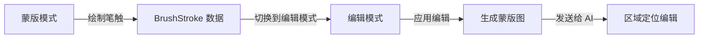
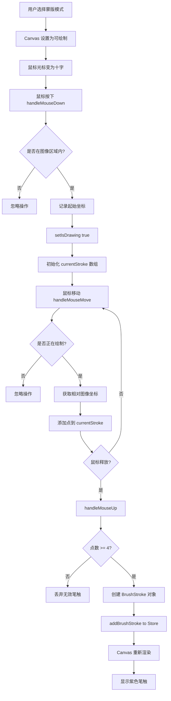
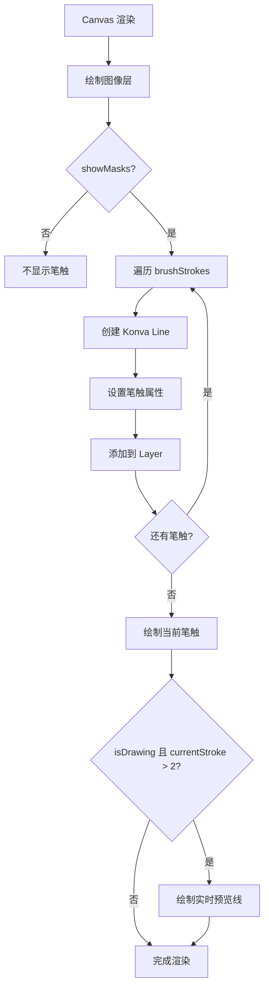
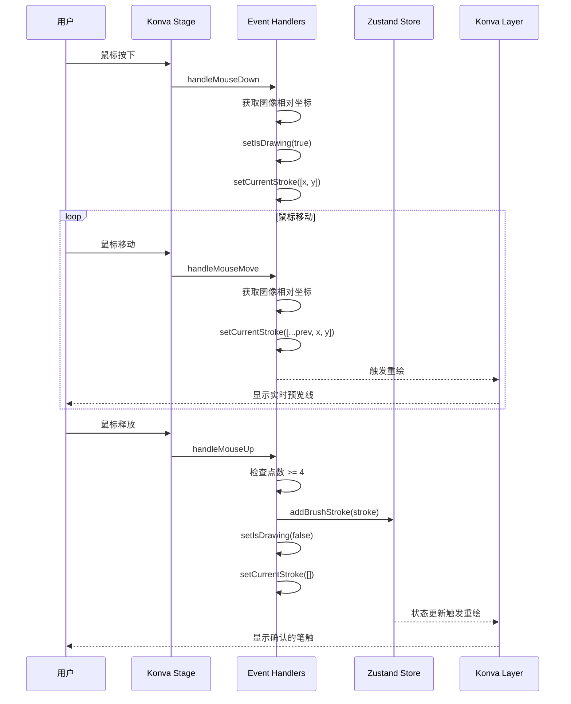
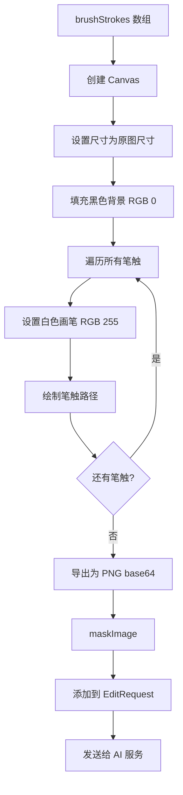

# 蒙版模式 (Mask)

本文档详细说明蒙版模式的完整流程和代码逻辑。

## 目录

- [模式概述](#模式概述)
- [核心流程](#核心流程)
- [时序图](#时序图)
- [数据结构](#数据结构)
- [代码实现](#代码实现)
- [UI 组件](#ui-组件)
- [蒙版到编辑的转换](#蒙版到编辑的转换)

---

## 模式概述

### 用途

在图像上绘制精确的编辑区域（蒙版），用于配合编辑模式实现区域定位编辑。

### 特点

| 特性 | 说明 |
|------|------|
| 绘制工具 | Konva.js Canvas 画笔 |
| 画笔大小 | 5 - 50 像素可调 |
| 笔触颜色 | 紫色 #A855F7 (显示) / 白色 (蒙版) |
| 可见性 | 可显示/隐藏蒙版 |
| 数据存储 | BrushStroke 数组 |

### 入口条件

```typescript
// src/store/useAppStore.ts
selectedTool: 'mask'
```

### 与编辑模式的关系



---

## 核心流程

### 绘制流程



### 渲染流程



---

## 时序图

### 绘制交互时序图



---

## 数据结构

### BrushStroke 类型

```typescript
// src/types/index.ts

export interface BrushStroke {
  id: string;           // 唯一标识符
  points: number[];     // 坐标点数组 [x1, y1, x2, y2, x3, y3, ...]
  brushSize: number;    // 画笔大小 (5 - 50)
  color: string;        // 显示颜色 #A855F7
}
```

### 示例数据

```typescript
const brushStroke: BrushStroke = {
  id: 'stroke-1710123456789',
  points: [100, 200, 105, 205, 110, 210, 115, 215, 120, 220],
  brushSize: 20,
  color: '#A855F7'
};
```

### Store 中的蒙版状态

```typescript
// src/store/useAppStore.ts

interface AppState {
  // ... 其他状态

  // 蒙版绘制状态
  brushStrokes: BrushStroke[];          // 所有笔触
  brushSize: number;                    // 当前画笔大小 (默认 20)
  showMasks: boolean;                   // 是否显示蒙版 (默认 true)
  selectedMask: SegmentationMask | null;

  // 蒙版操作
  addBrushStroke: (stroke: BrushStroke) => void;
  clearBrushStrokes: () => void;
  setBrushSize: (size: number) => void;
  setShowMasks: (show: boolean) => void;
  setSelectedMask: (mask: SegmentationMask | null) => void;
}
```

---

## 代码实现

### ImageCanvas 组件

```typescript
// src/components/ImageCanvas.tsx

const MASK_STROKE_COLOR = '#A855F7'; // 紫色

export const ImageCanvas: React.FC = () => {
  const {
    canvasImage,
    canvasZoom,
    setCanvasZoom,
    canvasPan,
    setCanvasPan,
    brushStrokes,
    addBrushStroke,
    clearBrushStrokes,
    showMasks,
    setShowMasks,
    selectedTool,
    isGenerating,
    brushSize,
    setBrushSize,
  } = useAppStore();

  const stageRef = useRef<KonvaStage | null>(null);
  const [image, setImage] = useState<HTMLImageElement | null>(null);
  const [stageSize, setStageSize] = useState({ width: 800, height: 600 });
  const [isDrawing, setIsDrawing] = useState(false);
  const [currentStroke, setCurrentStroke] = useState<number[]>([]);

  // ... 图像加载和尺寸计算

  // ========== 坐标转换 ==========
  const getImageRelativePointerPosition = (stage: KonvaStage) => {
    if (!image) return null;

    const relativePos = stage.getRelativePointerPosition();
    if (!relativePos) return null;

    // 计算图像在 Canvas 中的偏移
    const imageX = (stageSize.width / canvasZoom - image.width) / 2;
    const imageY = (stageSize.height / canvasZoom - image.height) / 2;

    // 转换为相对于图像的坐标
    const relativeX = relativePos.x - imageX;
    const relativeY = relativePos.y - imageY;

    // 检查是否在图像范围内
    if (relativeX < 0 || relativeX > image.width ||
        relativeY < 0 || relativeY > image.height) {
      return null;
    }

    return { x: relativeX, y: relativeY };
  };

  // ========== 鼠标事件处理 ==========
  const handleMouseDown = (e: KonvaEventObject<MouseEvent>) => {
    if (selectedTool !== 'mask' || !image) return;

    const stage = e.target.getStage();
    if (!stage) return;

    const pointer = getImageRelativePointerPosition(stage);
    if (!pointer) return;

    setIsDrawing(true);
    setCurrentStroke([pointer.x, pointer.y]);
  };

  const handleMouseMove = (e: KonvaEventObject<MouseEvent>) => {
    if (!isDrawing || selectedTool !== 'mask' || !image) return;

    const stage = e.target.getStage();
    if (!stage) return;

    const pointer = getImageRelativePointerPosition(stage);
    if (!pointer) return;

    setCurrentStroke((prev) => [...prev, pointer.x, pointer.y]);
  };

  const handleMouseUp = () => {
    if (!isDrawing || currentStroke.length < 4) {
      setIsDrawing(false);
      setCurrentStroke([]);
      return;
    }

    // 创建笔触对象
    addBrushStroke({
      id: `stroke-${Date.now()}`,
      points: currentStroke,
      brushSize,
      color: MASK_STROKE_COLOR,
    });

    setIsDrawing(false);
    setCurrentStroke([]);
  };

  // ... 渲染部分
};
```

### Konva Stage 配置

```typescript
<Stage
  ref={stageRef}
  width={stageSize.width}
  height={stageSize.height}
  scaleX={canvasZoom}
  scaleY={canvasZoom}
  x={canvasPan.x * canvasZoom}
  y={canvasPan.y * canvasZoom}
  draggable={selectedTool !== 'mask'}  // 蒙版模式下禁用拖拽
  onDragEnd={(e) => {
    setCanvasPan({
      x: e.target.x() / canvasZoom,
      y: e.target.y() / canvasZoom,
    });
  }}
  onMouseDown={handleMouseDown}
  onMouseMove={handleMouseMove}
  onMouseUp={handleMouseUp}
  style={{
    cursor: selectedTool === 'mask' ? 'crosshair' : 'default',
  }}
>
  <Layer>
    {/* 图像层 */}
    {image && (
      <KonvaImage
        image={image}
        x={(stageSize.width / canvasZoom - image.width) / 2}
        y={(stageSize.height / canvasZoom - image.height) / 2}
      />
    )}

    {/* 已确认的笔触 */}
    {showMasks && brushStrokes.map((stroke) => (
      <Line
        key={stroke.id}
        points={stroke.points}
        stroke={stroke.color}
        strokeWidth={stroke.brushSize}
        tension={0.5}
        lineCap="round"
        lineJoin="round"
        globalCompositeOperation="source-over"
        opacity={0.6}
        x={(stageSize.width / canvasZoom - (image?.width || 0)) / 2}
        y={(stageSize.height / canvasZoom - (image?.height || 0)) / 2}
      />
    ))}

    {/* 当前绘制中的笔触 */}
    {isDrawing && currentStroke.length > 2 && (
      <Line
        points={currentStroke}
        stroke={MASK_STROKE_COLOR}
        strokeWidth={brushSize}
        tension={0.5}
        lineCap="round"
        lineJoin="round"
        globalCompositeOperation="source-over"
        opacity={0.6}
        x={(stageSize.width / canvasZoom - (image?.width || 0)) / 2}
        y={(stageSize.height / canvasZoom - (image?.height || 0)) / 2}
      />
    )}
  </Layer>
</Stage>
```

---

## UI 组件

### 工具栏控件

```typescript
// src/components/ImageCanvas.tsx

// 蒙版模式下显示的控件
{selectedTool === 'mask' && (
  <>
    {/* 画笔大小调节 */}
    <div className="flex items-center space-x-2 mr-2">
      <span className="text-xs text-gray-400">
        {t('imageCanvas.brush')}:
      </span>
      <input
        type="range"
        min="5"
        max="50"
        value={brushSize}
        onChange={(e) => setBrushSize(parseInt(e.target.value, 10))}
        className="w-16 h-2 bg-gray-800 rounded-lg appearance-none cursor-pointer slider"
      />
      <span className="text-xs text-gray-400 w-6">{brushSize}</span>
    </div>

    {/* 清除笔触按钮 */}
    <Button
      variant="outline"
      size="sm"
      onClick={clearBrushStrokes}
      disabled={brushStrokes.length === 0}
    >
      <Eraser className="h-4 w-4" />
    </Button>
  </>
)}

{/* 显示/隐藏蒙版按钮 */}
<Button
  variant="outline"
  size="sm"
  onClick={() => setShowMasks(!showMasks)}
  className={cn(showMasks && 'bg-yellow-400/10 border-yellow-400/50')}
>
  {showMasks ? <Eye className="h-4 w-4" /> : <EyeOff className="h-4 w-4" />}
  <span className="hidden sm:inline ml-2">{t('imageCanvas.masks')}</span>
</Button>
```

### 底部状态栏

```typescript
// 笔触计数显示
<div className="flex items-center space-x-4">
  {brushStrokes.length > 0 && (
    <span className="text-yellow-400">
      {brushStrokes.length} {brushStrokes.length === 1
        ? t('imageCanvas.brushStroke')
        : t('imageCanvas.brushStrokes')}
    </span>
  )}
</div>
```

---

## 蒙版到编辑的转换

### 转换流程

当用户在编辑模式点击"应用编辑"时，蒙版笔触会被转换为黑白蒙版图像：



### 转换代码

```typescript
// src/hooks/useImageGeneration.ts (useImageEditing 内部)

if (brushStrokes.length > 0) {
  const tempImage = await loadImage(sourceImage);

  // 创建蒙版 Canvas
  const maskCanvas = document.createElement('canvas');
  const maskContext = maskCanvas.getContext('2d');

  maskCanvas.width = tempImage.width;
  maskCanvas.height = tempImage.height;

  // 黑色背景 (不被编辑区域)
  maskContext.fillStyle = 'black';
  maskContext.fillRect(0, 0, maskCanvas.width, maskCanvas.height);

  // 白色画笔 (编辑区域)
  maskContext.strokeStyle = 'white';
  maskContext.lineCap = 'round';
  maskContext.lineJoin = 'round';

  // 绘制所有笔触
  brushStrokes.forEach((stroke) => {
    if (stroke.points.length < 4) return;

    maskContext.lineWidth = stroke.brushSize;
    maskContext.beginPath();
    maskContext.moveTo(stroke.points[0], stroke.points[1]);

    for (let i = 2; i < stroke.points.length; i += 2) {
      maskContext.lineTo(stroke.points[i], stroke.points[i + 1]);
    }

    maskContext.stroke();
  });

  // 导出 base64
  maskImage = maskCanvas.toDataURL('image/png').split('base64,')[1];
}
```

### 蒙版图像示例

```
原始笔触显示 (紫色 #A855F7):
┌─────────────────┐
│                 │
│    ╭─────╮      │
│    │     │      │
│    ╰─────╯      │
│                 │
└─────────────────┘

转换后的蒙版 (黑白):
┌─────────────────┐
│ 000000000000000 │
│ 000001111110000 │
│ 000011111111000 │
│ 000011111111000 │
│ 000001111110000 │
│ 000000000000000 │
└─────────────────┘
0 = 黑色 (保持不变)
1 = 白色 (允许编辑)
```

---

## 模式切换影响

### 切换到蒙版模式

```typescript
setSelectedTool('mask')
  ↓
Canvas cursor = 'crosshair'
  ↓
Stage draggable = false
  ↓
显示画笔大小控件
  ↓
显示清除按钮
```

### 切换离蒙版模式

```typescript
setSelectedTool('generate' | 'edit')
  ↓
Canvas cursor = 'default'
  ↓
Stage draggable = true
  ↓
隐藏画笔控件
  ↓
笔触数据保留 (用于编辑模式)
```

---

*上一篇 [02_编辑模式.md](./02_编辑模式.md)* | 下一篇 [附录_类比与参考.md](./附录_类比与参考.md)*
