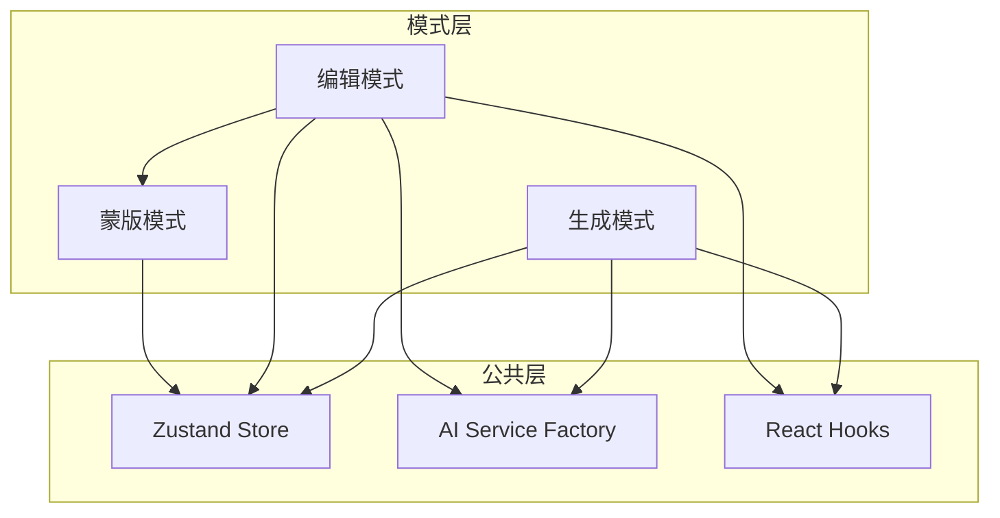

# Nano Banana Editor 模式分析文档

## 目录结构

```
模式分析/
├── README.md              # 索引文档 (当前文件)
├── 00_公共逻辑.md          # 公共逻辑和架构
├── 01_生成模式.md          # Generate 模式详解
├── 02_编辑模式.md          # Edit 模式详解
├── 03_蒙版模式.md          # Mask 模式详解
└── 附录_类比与参考.md       # 类比理解和参考引用
```

## 快速导航

| 文档 | 内容 |
|------|------|
| [00_公共逻辑.md](./00_公共逻辑.md) | 项目概述、整体架构、状态管理、AI服务工厂 |
| [01_生成模式.md](./01_生成模式.md) | 文本生成图像的完整流程和代码逻辑 |
| [02_编辑模式.md](./02_编辑模式.md) | 对话式编辑的完整流程和代码逻辑 |
| [03_蒙版模式.md](./03_蒙版模式.md) | 蒙版绘制的完整流程和代码逻辑 |
| [附录_类比与参考.md](./附录_类比与参考.md) | 类比理解和外部参考链接 |

## 模式概览

### 三种模式关系图



### 模式对比

| 特性 | 生成模式 | 编辑模式 | 蒙版模式 |
|------|----------|----------|----------|
| 输入 | 提示词 + 参考图 | 提示词 + 源图像 + 蒙版 | 鼠标绘制 |
| 输出 | 全新图像 | 修改后图像 | BrushStroke 数据 |
| 参考图上限 | 2 张 | 2 张 | - |
| 使用场景 | 创建新图像 | 修改现有图像 | 精确定位编辑区域 |

---

*文档生成时间: 2026-03-18*
*项目版本: v1.0*
